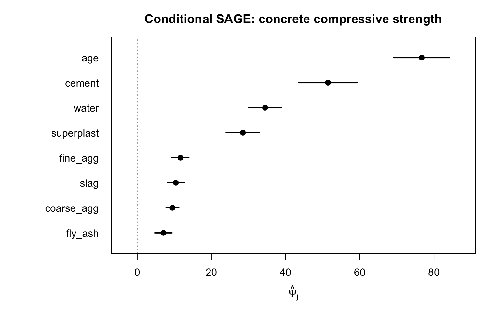

# shapCopula

**Semiparametric Inference for Conditional Shapley Feature Importance**

[](https://doi.org/10.5281/zenodo.20392903)
[](https://doi.org/10.48550/arXiv.2609.10313)

R implementation accompanying:

> Gnasso, A. (2026). *Semiparametric Inference for Conditional Shapley Feature Importance*. arXiv:2609.10313. <https://doi.org/10.48550/arXiv.2609.10313>

---

## The problem

Shapley-based feature importance is usually reported as a bare number. You learn
that a feature scored 0.31, but not whether 0.31 is distinguishable from noise,
and not how much it would move if you collected a second sample of the same size.
Standard implementations give you a point estimate and stop there.

There is a second problem underneath. To score a coalition of features, a Shapley
method has to integrate out the features left out of it. The usual choice is to
draw them from their **marginal** distribution, independently of the ones kept in.
When features are dependent, that asks the model to predict on combinations that
never occur — a mix with the water content of one recipe and the plasticiser of
another — and the resulting attributions reflect the model's behaviour off the
data manifold as much as its behaviour on it.

`shapCopula` addresses both. It targets the **conditional** value function
*v(S; x) = E[f(X) | X_S = x_S]*, so out-of-coalition features are drawn from
their true conditional law, estimated with a copula. And it estimates the global
(SAGE) importance with a one-step cross-fitted estimator, which delivers a
standard error, a confidence interval and a p-value with a coverage guarantee
rather than a heuristic.

The output is a table you can act on:

```
    feature psi_hat    se ci_lo ci_hi     z   pvalue
        age   76.68 3.843 69.15 84.21 19.96 0.00e+00
     cement   51.41 4.041 43.49 59.33 12.72 0.00e+00
    fly_ash    7.05 1.188  4.72  9.37  5.93 2.99e-09
```

---

## Installation

```r
# install.packages("remotes")
remotes::install_github("agostinognasso/shapCopula")
```

Requires R >= 4.1 and `rvinecopulib`.

---

## Quick start

The estimators take a prediction *function* and a data matrix, so they work with
any model — `ranger`, `xgboost`, `lm`, a neural net behind an API, anything that
maps a matrix of features to a vector of predictions.

```r
library(shapCopula)

set.seed(1)
n <- 500; p <- 5
Sigma <- diag(p); Sigma[1, 2] <- Sigma[2, 1] <- 0.7   # X1 and X2 are dependent
X <- matrix(rnorm(n * p), n, p) %*% chol(Sigma)
colnames(X) <- paste0("X", 1:p)

f <- function(Xm) 2 * Xm[, 1] - Xm[, 2]               # your fitted model

result <- sage_cv_gcop(f, X, K = 3, M = 30, B = 20, seed = 1)
result
plot(result)
```

---

## Case study: concrete compressive strength

The UCI *Concrete Compressive Strength* data records the mix composition of 1030
concrete samples and the strength each reached. The eight predictors are not
independent: superplasticiser and water correlate at −0.66, because plasticiser
is what lets you cut the water down; fine aggregate and water at −0.45; fly ash
and cement at −0.40. This is the setting where the choice of value function stops
being academic.

### Fitting a model and explaining it

```r
library(shapCopula)
library(ranger)

d <- read.csv("concrete.csv")   # UCI: Concrete Compressive Strength
names(d) <- c("cement", "slag", "fly_ash", "water", "superplast",
              "coarse_agg", "fine_agg", "age", "strength")

set.seed(42)
train <- d[sample(nrow(d), 800), ]
X <- as.matrix(train[, 1:8])

rf <- ranger(strength ~ ., data = train, num.trees = 500, seed = 42)
f_predict <- function(Xm) predict(rf, data = as.data.frame(Xm))$predictions

cond <- sage_cv_gcop(f_predict, X, K = 3, M = 30, B = 20, seed = 1)
cond
```

```
Conditional SAGE values with Wald inference
  sampler: Gaussian copula   folds: 3   permutations: 30   level: 95%

    feature psi_hat    se ci_lo ci_hi     z   pvalue
     cement   51.41 4.041 43.49 59.33 12.72 0.00e+00
       slag   10.40 1.156  8.13 12.66  9.00 0.00e+00
    fly_ash    7.05 1.188  4.72  9.37  5.93 2.99e-09
      water   34.46 2.241 30.07 38.85 15.38 0.00e+00
 superplast   28.46 2.295 23.96 32.96 12.40 0.00e+00
 coarse_agg    9.49 0.896  7.73 11.25 10.59 0.00e+00
   fine_agg   11.63 1.156  9.37 13.90 10.06 0.00e+00
        age   76.68 3.843 69.15 84.21 19.96 0.00e+00
```

### Reading the table

**`psi_hat` is on the scale of the outcome's variance.** It is the average
reduction in squared prediction error attributable to the feature, in MPa².
Age accounts for 76.7 MPa² of predictable variance, cement 51.4, fly ash 7.0.
Ratios are meaningful: age carries roughly one and a half times the information
of cement, and eleven times that of fly ash.

**The values add up.** Summing the column gives 229.6, against a variance of the
model's predictions of 228.0 — agreement to within 0.7%, which is Monte Carlo
error. That additivity is the defining property of a Shapley decomposition: the
importances partition the predictable variance rather than merely ranking the
features.

**`ci_lo` and `ci_hi` are what point estimates cannot give you.** Fly ash scores
7.05 with an interval of [4.72, 9.37]. Coarse aggregate scores 9.49 with
[7.73, 11.25]. The point estimates differ, but the intervals overlap heavily: on
800 samples these two are not separable, and any narrative that ranks one above
the other is reading noise. Meanwhile age's interval, [69.2, 84.2], is nowhere
near cement's [43.5, 59.3] — that gap is real.

**`pvalue` tests H₀: Ψⱼ = 0**, that the feature adds nothing given the others.
Here every feature clears it. That is common with n = 800 and a strong model
(OOB R² = 0.89) and it is informative: none of the eight components is redundant.
With more features, or fewer observations, the null features are the ones you
want to find — and finding them is the point of having a test.

**When you test all p features, adjust.** Eight tests at α = 0.05 is eight
chances to be fooled. `p.adjust(cond$pvalue, method = "bonferroni")` is the
conservative option and is what the paper reports.

### The plot

```r
plot(cond)
```



Intervals are drawn solid where they exclude zero and dashed where they do not,
so the outcome of the test is visible without going back to the table.

### Conditional against marginal

The same machinery runs with the marginal value function, which is what standard
SHAP implementations use. Running both is the honest way to see how much your
conclusions depend on that choice:

```r
marg <- sage_cv_marginal(f_predict, X, K = 3, M = 30, B = 20, seed = 1)

data.frame(feature = cond$feature,
           conditional = cond$psi_hat,
           marginal = marg$psi_hat,
           ratio = marg$psi_hat / cond$psi_hat)
```

```
    feature conditional marginal ratio
        age       76.68    74.64  0.97
     cement       51.41    59.06  1.15
      water       34.46    35.39  1.03
 superplast       28.46    23.94  0.84
   fine_agg       11.63     8.93  0.77
       slag       10.40    12.63  1.22
 coarse_agg        9.49     9.75  1.03
    fly_ash        7.05     5.90  0.84
```

Age, water and coarse aggregate agree within 3%. Slag, cement, superplasticiser
and fine aggregate move by 15–23%, and in both directions: the marginal estimator
credits cement and slag more, superplasticiser and fine aggregate less.

It is tempting to expect the disagreement to track how correlated each feature
is. It does not. In this data the correlation between a feature's strongest
pairwise dependence and the size of the disagreement is **0.12** — effectively
none. Water is the most dependent feature in the set (−0.66 with
superplasticiser) and the two estimators agree on it almost exactly; slag is
among the least dependent and they differ by 22%.

The reason is that the gap depends on the *joint* dependence structure and on how
the model actually uses each feature, not on any single correlation. There is no
shortcut that lets you predict the discrepancy from a correlation matrix, which
is precisely the argument for estimating it. If the two disagree on a feature
that matters to your decision, the conditional value is the one that answers
"what does this feature tell me about the prediction, in the population that
generated my data".

### Vine copulas for non-Gaussian dependence

`sage_cv_gcop()` models dependence with a Gaussian copula: flexible marginals,
but a dependence structure with no tail asymmetry. When that is too restrictive,
`sage_cv()` fits a vine copula instead.

```r
res_vine <- sage_cv(f_predict, X, K = 3, M = 30, B = 20,
                    family_set = "parametric", seed = 1)
```

Conditional draws are exact rather than approximate. The coalitions visited along
a Shapley permutation are its prefixes, so fitting one D-vine per permutation
with the reversed variable order makes each of them conditionable through the
Rosenblatt transform. The cost is one vine fit per permutation, which makes
`sage_cv()` several times slower than `sage_cv_gcop()`; start with the Gaussian
version and move to the vine if you have reason to believe the dependence is
asymmetric or tail-heavy.

---

## Functions

| Function | Value function | Dependence model | When to use |
|---|---|---|---|
| `sage_cv_gcop()` | conditional | Gaussian copula, empirical marginals | the default; p up to about 15 |
| `sage_cv()` | conditional | vine copula, exact conditioning | non-Gaussian dependence; p up to about 10 |
| `sage_cv_marginal()` | marginal | none | the interventional baseline, for comparison |
| `fit_gauss_copula()` | — | — | the underlying Gaussian copula fit |
| `fit_copula()` | — | — | the underlying vine fit; `order` fixes the D-vine structure |

All three estimators return a `sage_estimate`, which is a `data.frame` with
`print()` and `plot()` methods attached — you can subset it, sort it or write it
to CSV as usual.

---

## Choosing K, M and B

`K` folds, `M` permutations, `B` conditional draws. Defaults are `K = 3`,
`M = 30`, `B = 20`.

**`B` controls Monte Carlo noise, not bias.** The estimator splits the `B` draws
into two independent sub-batches and multiplies the two residuals, which makes
the squared-loss term exactly unbiased. That is why `B = 20` suffices where a
naive plug-in would need hundreds.

**`M` controls the resolution of the Shapley average.** Raise it when estimates
move noticeably between seeds.

**`K` is the one to watch on small samples.** The copula is fitted on `n(K-1)/K`
rows, and a copula fitted on too few rows degrades the estimates in a way that
shows up as small negative values on features that are genuinely null. As a rough
guide, with `n = 200` and `p = 4`, `K = 2` leaves 100 training rows and produces
visible negative bias; `K = 5` leaves 160 and it largely disappears. If your
sample is small relative to `p`, prefer more folds, and treat a significantly
negative estimate as a diagnostic that the nuisance is under-fitted rather than
as a finding about the feature.

Runtime scales as O(K · M · p · n · B). The case study above, at n = 800 and
p = 8, takes about 140 seconds for `sage_cv_gcop()` and 66 for
`sage_cv_marginal()` on a laptop.

---

## Reproducing the paper

The simulation and application scripts live in the parent research repository,
under `reproduction/` and `Applicazione/`.

```bash
Rscript reproduction/run_simA_calibration.R              # calibration
Rscript reproduction/run_simB_power.R                    # power
Rscript reproduction/run_simC_correlation.R              # coverage vs correlation
Rscript reproduction/run_simD_misspecification.R         # copula misspecification
Rscript reproduction/run_simE_conditional_vs_marginal.R  # conditional vs marginal
Rscript Applicazione/run_applications_v2.R               # UCI Concrete, California Housing
```

Set `R_REPS` to shorten a run: `R_REPS=3 Rscript reproduction/run_simA_calibration.R`.

---

## Citation

```r
citation("shapCopula")
```

---

## References

Aas, K., Jullum, M., & Løland, A. (2021). Explaining individual predictions when
features are dependent: More accurate approximations to Shapley values.
*Artificial Intelligence*, 298, 103502.

Covert, I., Lundberg, S., & Lee, S.-I. (2020). Understanding global feature
contributions with additive importance measures. *NeurIPS 33*.

Hooker, G., Mentch, L., & Zhou, S. (2021). Unrestricted permutation forces
extrapolation. *Statistics and Computing*, 31(6), 82.

Williamson, B. D., Gilbert, P. B., Carone, M., & Simon, N. (2023). A general
framework for inference on algorithm-agnostic variable importance. *JASA*.

---

## License

MIT © Agostino Gnasso
